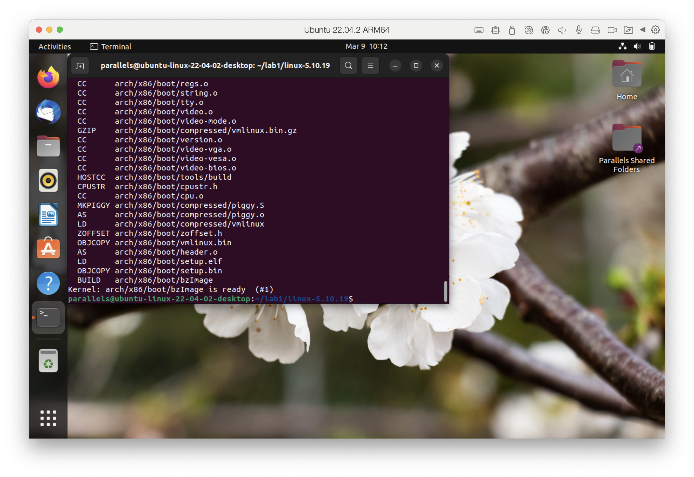
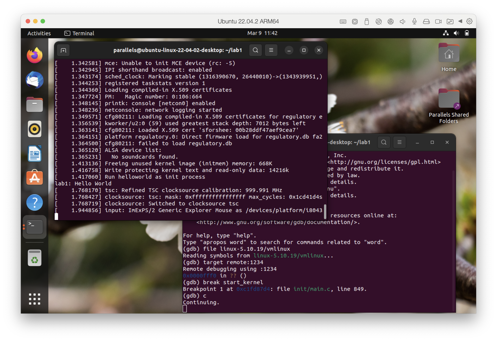
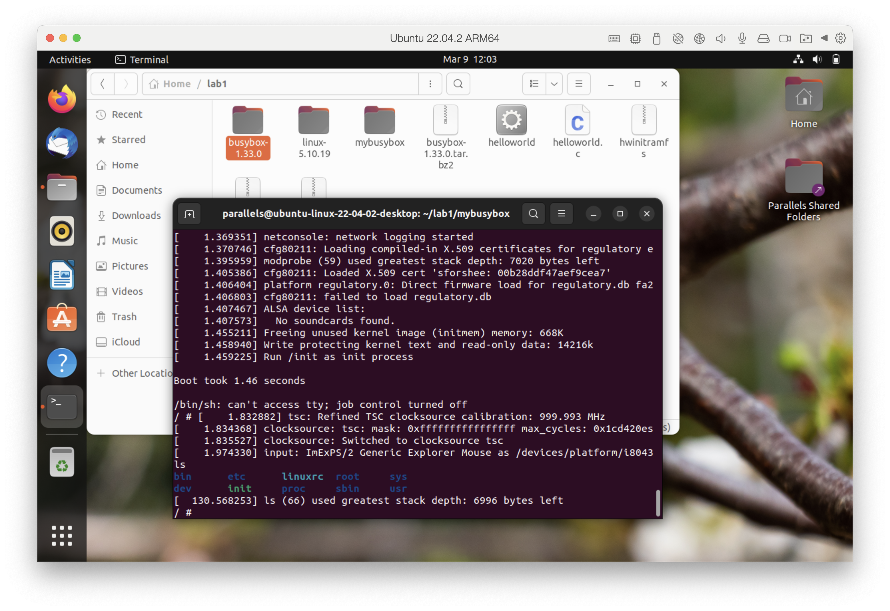

# 在Ubuntu ARM64使用i686交叉编译器

## 资源链接

1. [原实验指导lab1](https://gitee.com/qin_chu_yan/sysu-2024-spring-operating-system/blob/main/lab1/README.md)
2. [i686交叉编译器制作指南](https://github.com/Nelson-Cheung/i686-compiler/blob/main/README.md)

## 实验概述

​	独立完成实验5个部分环境配置、编译Linux内核、Qemu启动内核并开启远程调试、制作Initramfs和编译并启动Busybox。

1. 搭建OS内核开发环境包括：代码编辑环境、编译环境、运行环境、调试环境等。
2. 下载并编译i386（32位）内核，并利用qemu启动内核。
3. 熟悉制作initramfs的方法。
4. 编写简单应用程序随内核启动运行。
5. 编译i386版本的Busybox，随内核启动，构建简单的OS。
6. 开启远程调试功能，进行调试跟踪代码运行。

## 具体步骤

### 环境配置

#### 换源

备份原先下载源。

```
sudo mv /etc/apt/sources.list /etc/apt/sources.list.backup
```

打开下载源文件并更换。

```
sudo gedit /etc/apt/sources.list
```

更新apt。

```
sudo apt update
```

#### 配置c++环境和下载工具

配置c++环境。

```
sudo apt install binutils
sudo apt install gcc
```

安装其他工具。

```
sudo apt install nasm
sudo apt install qemu
sudo apt install cmake
sudo apt install libncurses5-dev
sudo apt install bison
sudo apt install flex
sudo apt install libssl-dev
```

安装其他工具（资源教程中未列，但是有的工具要用到）

~~~
sudo apt install vim
~~~

#### 制作i686交叉编译器

安装需要的环境。

~~~
sudo apt update
sudo apt install -y build-essential git texinfo bison flex m4
~~~

下载交叉编译器代码。

~~~
cd ~/
git config --global http.sslVerify false
git clone https://github.com/NelsonCheung-cn/i686-compiler.git
cd i686-compiler
~~~

设置环境变量。

~~~
export PATH=$PATH:/opt/i686/bin
alias sudo='sudo env PATH=$PATH:/opt/i686/bin'
~~~

编译binutils。

~~~
cd ~/i686-compiler/binutils
mkdir build && cd build
../configure --prefix=/opt/i686/ --target=i686-linux-gnu
make -j$(nproc)
sudo make -j$(nproc) install
~~~

编译Linux内核i386架构的头文件。

~~~
cd ~/i686-compiler/linux
sudo make ARCH=i386 INSTALL_HDR_PATH=/opt/i686/i686-linux-gnu/ headers_install
sudo cp /opt/i686/i686-linux-gnu/include/linux/limits.h /opt/i686/i686-linux-gnu/include/limits.h
~~~

注意！在下面的编译automake这一步的第三条指令和第四条指令可能会出现报错，原因是没有安装autoconf，因此需要提前安装。

~~~
sudo apt install autoconf
~~~

安装autoconf后可能会出现安装不完整的情况，漏掉aclocal，可以用ls指令检查，若不存在，就在 Automake 项目的根目录中运行 `autoreconf`，它会尝试重新生成 `aclocal.m4` 文件和其他必要的文件。

手动检查（具体路径可能不同需要修改）

~~~
ls /home/parallels/i686-compiler/automake/build/bin/aclocal
~~~

重新生成 `aclocal.m4` 文件和其他必要的文件。

~~~
autoreconf --force --install
~~~

编译automake。

~~~
cd ~/i686-compiler/automake
mkdir build && cd build
../configure  --prefix=/opt/i686
make -j$(nproc)
sudo make -j$(nproc) install
~~~

编译gmp库。

~~~
cd ~/i686-compiler/gcc/gmp
mkdir build && cd build
../configure --prefix=/opt/i686/
make -j$(nproc)
sudo make -j$(nproc) install
~~~

编译mpfr库。

~~~
cd ~/i686-compiler/gcc/mpfr
mkdir build && cd build
../configure --prefix=/opt/i686/ --with-gmp=/opt/i686/ 
make -j$(nproc)
sudo make -j$(nproc) install
~~~

编译mpc库。

~~~
cd ~/i686-compiler/gcc/mpc
mkdir build && cd build
../configure --prefix=/opt/i686/ --with-gmp=/opt/i686/ --with-mpfr=/opt/i686/
make -j$(nproc)
sudo make -j$(nproc) install
~~~

编译isl库。

~~~
cd ~/i686-compiler/gcc/isl
mkdir build && cd build
../configure --prefix=/opt/i686/ --with-gmp-prefix=/opt/i686/
make -j$(nproc)
sudo make -j$(nproc) install
~~~

编译C/C++编译器。

~~~
cd ~/i686-compiler/gcc
mkdir build && cd build
../configure --prefix=/opt/i686/ --target=i686-linux-gnu --enable-languages=c,c++ --disable-multilib --disable-werror
make -j$(nproc) all-gcc
sudo make -j$(nproc) install-gcc
~~~

编译Glibc标准库文件和Gcc后续编译需要的文件。

~~~
cd ~/i686-compiler/glibc
mkdir build && cd build
../configure --prefix=/opt/i686/i686-linux-gnu/ --host=i686-linux-gnu --target=i686-linux-gnu --disable-werror --disable-multilib
sudo make install-bootstrap-headers=yes install-headers
sudo make -j$(nproc) csu/subdir_lib 
sudo install csu/crt1.o csu/crti.o csu/crtn.o /opt/i686/i686-linux-gnu/lib
sudo i686-linux-gnu-gcc -nostdlib -nostartfiles -shared -x c /dev/null -o /opt/i686/i686-linux-gnu/lib/libc.so
sudo touch /opt/i686/i686-linux-gnu/include/gnu/stubs.h
~~~

编译libgcc。

~~~
cd ~/i686-compiler/gcc/build
make -j$(nproc) all-target-libgcc
sudo make install-target-libgcc
~~~

编译Glibc。

~~~
cd ~/i686-compiler/glibc/build
sudo make -j$(nproc)
sudo make -j$(nproc) install
~~~

编译标准C++库。

~~~
cd ~/i686-compiler/gcc/build
make -j$(nproc)
sudo make -j$(nproc) install
~~~

最后，在`/opt/i686/bin`下可以看到交叉编译器。

~~~
ls /opt/i686/bin
~~~

终端显示如下。

~~~
i686-linux-gnu-addr2line
i686-linux-gnu-ar
i686-linux-gnu-as
i686-linux-gnu-c++
i686-linux-gnu-c++filt
i686-linux-gnu-cpp
i686-linux-gnu-elfedit
i686-linux-gnu-g++
i686-linux-gnu-gcc
i686-linux-gnu-gcc-11.1.0
i686-linux-gnu-gcc-ar
i686-linux-gnu-gcc-nm
i686-linux-gnu-gcc-ranlib
i686-linux-gnu-gcov
i686-linux-gnu-gcov-dump
i686-linux-gnu-gcov-tool
i686-linux-gnu-gprof
i686-linux-gnu-ld
i686-linux-gnu-ld.bfd
i686-linux-gnu-lto-dump
i686-linux-gnu-nm
i686-linux-gnu-objcopy
i686-linux-gnu-objdump
i686-linux-gnu-ranlib
i686-linux-gnu-readelf
i686-linux-gnu-size
i686-linux-gnu-strings
i686-linux-gnu-strip
~~~

#### 安装i686交叉编译器

安装gdb多体系结构包。

~~~
sudo apt install gdb-multiarch
~~~

安装交叉编译器。

~~~
sudo apt install binutils-i686-linux-gnu gcc-i686-linux-gnu g++-i686-linux-gnu gdbmultiarc qemu-system-x86
~~~

至此i686交叉编译器安装完成。i686架构是 i386的⼦集，也可以完成i386架构编译的任务。为了在编译的时候和普通的编译器区分开来，需要在编译的命令前⾯加上特定的前缀，⽐如 i686交叉编译器的前缀是 i686-linux-gnu- 。⽽在我们编译代码的时候，我们都需要加上这个前缀。

### 编译LInux内核

#### 下载内核

在lab1文件夹中完成实验。

~~~
mkdir ~/lab1
cd ~/lab1
~~~

下载内核。

~~~
wget https://mirrors.tuna.tsinghua.edu.cn/kernel/v5.x/linux-5.10.19.tar.xz
~~~

解压并进入。

~~~
xz -d linux-5.10.19.tar.xz
tar -xvf linux-5.10.19.tar
cd linux-5.10.19
~~~

#### 编译内核

~~~
make ARCH=i386 CROSS_COMPILE=i686-linux-gnu- i386_defconfig
make ARCH=i386 CROSS_COMPILE=i686-linux-gnu- menuconfig
~~~

在打开的图像界面中依次选择`Kernel hacking`、`Compile-time checks and compiler options`，最后在`[ ] Compile the kernel with debug info`输入`Y`勾选，保存退出。

编译内核，这一步较慢。

~~~
make ARCH=i386 CROSS_COMPILE=i686-linux-gnu- -j2
~~~

注意！资料中的这一步代码没有最后的2，会使我的parallels Ubuntu虚拟机内存占用满，导致黑屏重启(out of memory)，加一个2使减少并行任务的数量（编译系统一次执行2个任务）就能正常编译完成。

检查Linux压缩镜像`linux-5.10.19/arch/x86/boot/bzImage`和符号表`linux-5.10.19/vmlinux`是否已经生成。



### 启动内核并调试

####  启动qemu

进入lab1文件夹。

~~~
cd ~/lab1
~~~

使用`qemu`启动内核并开启远程调试。

~~~
qemu-system-i386 -kernel linux-5.10.19/arch/x86/boot/bzImage -s -S -append "console=ttyS0" -nographic
~~~

此时，qemu并未输出任何信息。这是因为我们开启了gdb调试，而qemu在等待gdb输入的指令后才能继续执行。接下来我们启动gdb，通过gdb来告诉qemu应该怎么做。

#### gdb调试

在另外一个Terminal下启动gdb，注意，不要关闭qemu所在的Terminal。

注意！资料中别人的代码展示中第二条指令直接是gdb，好像成功了，但是我要输入gdb-multiarch才能正常用i386架构的gdb，可能她是直接接在编译内核之后的所以不用指明要用不同的体系结构。

~~~
cd ~/lab1
gdb-multiarch
~~~

在gdb下，加载符号表。

```
file linux-5.10.19/vmlinux
```

在gdb下，连接已经启动的qemu进行调试。

```
target remote:1234
```

在gdb下，为start_kernel函数设置断点。

```
break start_kernel
```

在gdb下，输入`c`运行。

```
c
```

在继续执行后，最终qemu的输出如下，在qemu虚拟机里运行的Linux系统能成功启动，并且最终以Kernel panic宣告结束。看到call trace打出来的是在initrd_load的时候出错，原因很简单，因为启动系统的时候只指定了bzImage，没有指定initrd文件，系统无法mount上initrd (init ram disk) 及其initramfs文件系统。

###  制作Initramfs

进入lab1文件夹。

```
cd ~/lab1
```

#### 写下hello world程序

```
#include <stdio.h>

void main()
{
    printf("lab1: Hello World\n");
    fflush(stdout);
    /* 让程序打印完后继续维持在用户态 */
    while(1);
}
```

保存（vim中输入 :wq 指令退出）

上述文件保存在`~/lab1/helloworld.c`中，然后将上面代码编译成32位可执行文件。

```
i686-linux-gnu-gcc -o helloworld -m32 -static helloworld.c
```

####  加载initramfs

用cpio打包initramfs。

```
echo helloworld | cpio -o --format=newc > hwinitramfs
```

启动内核，并加载initramfs。

```
qemu-system-i386 -kernel linux-5.10.19/arch/x86/boot/bzImage -initrd hwinitramfs -s -S -append "console=ttyS0 rdinit=helloworld" -nographic
```

重复上面的gdb的调试过程，可以看到qemu中输出了`lab1: Hello World\n`。



### 编译并启动busybox

#### 下载并解压

进入lab1文件夹。

```
cd ~/lab1
```

进入官网下载。

~~~ 
wget https://busybox.net/downloads/busybox-1.33.0.tar.bz2
~~~

解压。

```
tar -xf busybox-1.33.0.tar.bz2
```

#### 编译busybox

~~~
cd busybox-1.33.0
make ARCH=i386 CROSS_COMPILE=i686-linux-gnu- i386_defconfig
make ARCH=i386 CROSS_COMPILE=i686-linux-gnu- menuconfig
~~~

进入`settings`，然后在`Build static binary(no shared libs)`处输入`Y`勾选，然后`ENTER`选中`() Additional CFLAGS`并键入`-m32 -march=i386`，同理在`() Additional LDFLAGS` 键入`-m32`。

保存退出，然后编译。

```
make ARCH=i386 CROSS_COMPILE=i686-linux-gnu- -j8
make ARCH=i386 CROSS_COMPILE=i686-linux-gnu- install
```

#### 制作Initramfs

将安装在_install目录下的文件和目录取出放在`~/lab1/mybusybox`处。

```
cd ~/lab1
mkdir mybusybox
mkdir -pv mybusybox/{bin,sbin,etc,proc,sys,usr/{bin,sbin}}
cp -av busybox-1.33.0/_install/* mybusybox/
cd mybusybox
```

initramfs需要一个init程序，可以写一个简单的shell脚本作为init。

用vim打开文件`init`。

```
vim init
```

复制入如下内容，保存退出。

```
#!/bin/sh
mount -t proc none /proc
mount -t sysfs none /sys
echo -e "\nBoot took $(cut -d' ' -f1 /proc/uptime) seconds\n"
exec /bin/sh
```

加上执行权限。

```
chmod u+x init
```

将mybusybox中的内容打包归档成cpio文件，以供Linux内核做initramfs启动执行。

```
find . -print0 | cpio --null -ov --format=newc | gzip -9 > ~/lab1/initramfs-busybox-x86.cpio.gz
```

#### 加载busybox

```
cd ~/lab1
qemu-system-i386 -kernel linux-5.10.19/arch/x86/boot/bzImage -initrd initramfs-busybox-x86.cpio.gz -nographic -append "console=ttyS0"
```

然后使用`ls`命令即可看到当前文件夹。




